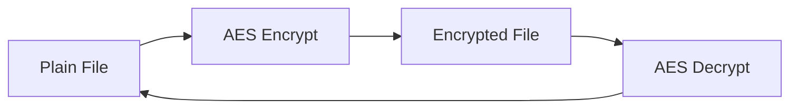
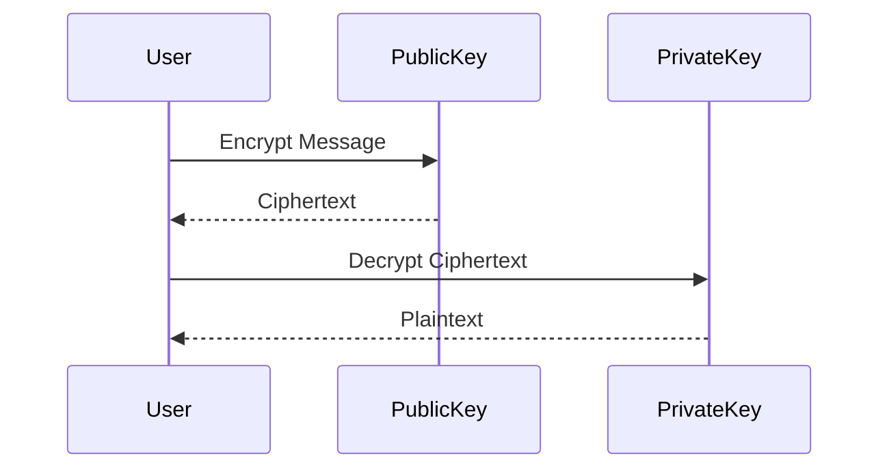
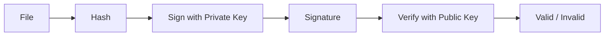
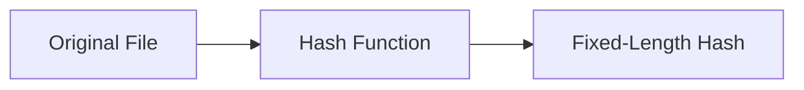
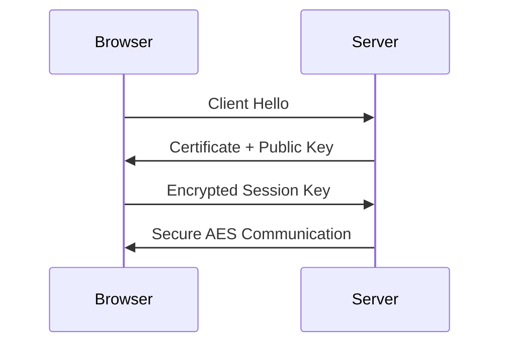

# 🔐 Cryptography Fundamentals & Practical Lab

A hands-on repository to understand encryption, hashing, digital signatures, and real-world cryptographic usage.

---

## 📌 Objectives

- Learn symmetric vs asymmetric encryption
- Encrypt files using AES
- Generate RSA keys
- Understand digital signatures
- Hash files and verify integrity
- Compare encryption algorithms
- Understand real-world usage (HTTPS, VPN)
- Document cryptographic findings

---

## 🧠 1. Symmetric vs Asymmetric Encryption

### 🔁 Symmetric Encryption (Single Key)

```text
Plaintext ──► [ Encrypt ]
                 │
                 ▼
            Ciphertext
                 │
                 ▼
             [ Decrypt ]
                 │
                 ▼
              Plaintext

(Same Secret Key)
````

* One shared secret key
* Fast and efficient
* Key distribution is risky

**Examples:** AES, Blowfish, DES (deprecated)

---

### 🔑 Asymmetric Encryption (Key Pair)

```text
Sender                         Receiver
------                         --------
Plaintext ──► Encrypt (Public Key)
                      │
                      ▼
                 Ciphertext ──► Decrypt (Private Key)
                                        │
                                        ▼
                                     Plaintext
```

* Public key encrypts
* Private key decrypts
* Slower but more secure for key exchange

**Examples:** RSA, ECC, DSA

---

### ⚖️ Comparison

| Feature  | Symmetric | Asymmetric       |
| -------- | --------- | ---------------- |
| Keys     | One       | Public + Private |
| Speed    | Fast      | Slow             |
| Security | Medium    | High             |
| Usage    | Bulk data | Key exchange     |

---

## 🔐 2. Encrypt Files Using AES

AES = Advanced Encryption Standard (Symmetric)

### 📄 Encrypt File

```bash
openssl enc -aes-256-cbc -salt -in secret.txt -out secret.enc
```

### 🔓 Decrypt File

```bash
openssl enc -aes-256-cbc -d -in secret.enc -out secret.txt
```

### 🔍 AES Workflow Diagram



---

## 🔑 3. RSA Key Generation

RSA is an asymmetric algorithm.

### 🔐 Generate Private Key

```bash
openssl genrsa -out private.key 2048
```

### 🔓 Extract Public Key

```bash
openssl rsa -in private.key -pubout -out public.key
```

### 🔁 RSA Encryption Flow



---

## ✍️ 4. Digital Signatures

Digital signatures ensure:

* Authenticity
* Integrity
* Non-repudiation

### 📝 Create Signature

```bash
openssl dgst -sha256 -sign private.key -out signature.bin file.txt
```

### ✅ Verify Signature

```bash
openssl dgst -sha256 -verify public.key -signature signature.bin file.txt
```

### 🖊️ Signature Diagram



---

## 🧾 5. Hashing & Integrity Verification

Hashing is **one-way** (irreversible).

### 🔢 Generate Hash

```bash
sha256sum file.txt
```

### 🔍 Verify Integrity

```bash
sha256sum -c file.txt.sha256
```

### 🔄 Hash Flow



---

### 📌 Hash Algorithm Status

| Algorithm | Status        |
| --------- | ------------- |
| MD5       | ❌ Broken      |
| SHA1      | ❌ Weak        |
| SHA256    | ✅ Secure      |
| SHA512    | ✅ Very Secure |

---

## 📊 6. Encryption Algorithm Comparison

| Algorithm | Type       | Key Size | Usage         |
| --------- | ---------- | -------- | ------------- |
| AES       | Symmetric  | 128/256  | VPN, Files    |
| RSA       | Asymmetric | 2048+    | TLS           |
| ECC       | Asymmetric | Small    | Mobile, HTTPS |
| Blowfish  | Symmetric  | Variable | Legacy        |

---

## 🌐 7. Real-World Usage

### 🔒 HTTPS (TLS)



* RSA/ECC → Key exchange
* AES → Data encryption
* Certificates → Trust

---

### 🛡 VPN Encryption Tunnel

```text
[ User Device ]
      │
      │ Encrypted Tunnel (AES)
      ▼
[ VPN Server ]
      │
      ▼
[ Internet ]
```

---

## 🧪 8. Findings & Observations

* Asymmetric encryption is not used for large data
* Symmetric encryption is faster but needs secure key exchange
* Hashing ≠ Encryption
* Digital signatures ≠ Encryption
* Real-world security uses **hybrid cryptography**

---

## 📁 Suggested Repository Structure

```text
crypto-lab/
├── README.md
├── notes/
│   ├── symmetric-vs-asymmetric.md
│   ├── hashing.md
│   └── digital-signatures.md
├── labs/
│   ├── aes-encryption/
│   ├── rsa-keys/
│   └── hash-verification/
└── diagrams/
```

---

## 🚀 Future Enhancements

* TLS handshake analysis (Wireshark)
* AES vs ChaCha20 benchmarking
* MITM & replay attack demos
* Automation using Bash/Python
