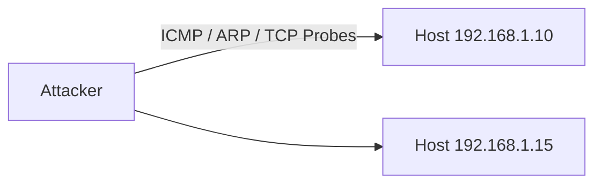
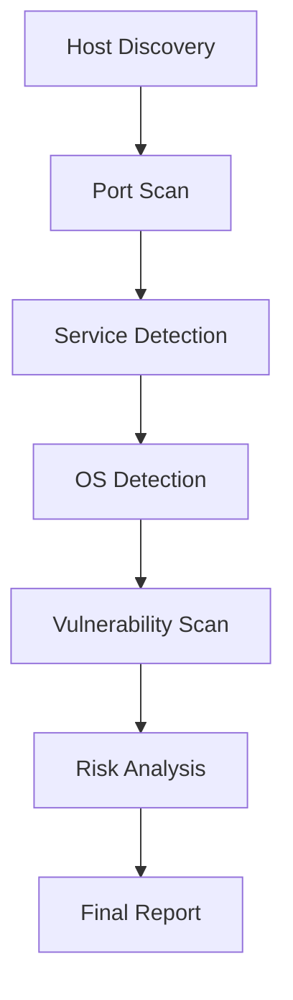

# 🔥 Nmap Network Scanning Guide 

> **Professional Nmap Workflow — Deep Explanations, Keywords, Diagrams & Outputs**

This repository provides a **complete, structured, and visual guide** to network scanning using **Nmap**, covering everything from host discovery to vulnerability scanning, risk analysis, and reporting.

---

## 📌 Table of Contents

1. Introduction  
2. Network Topology Overview  
3. Host Discovery (Ping Sweep)  
4. Full Port Scanning  
5. Service & Version Detection  
6. OS Detection  
7. Vulnerability Scanning (NSE)  
8. Saving & Reporting Results  
9. Risk Interpretation & Analysis  
10. Documentation & Reporting  
11. Masscan (Fast Scanning Alternative)  
12. Complete Scanning Workflow  

---

## 📌 1. Introduction

This guide demonstrates a **real-world Nmap scanning workflow**, including:

- Host Discovery  
- Port Scanning  
- Service Enumeration  
- OS Fingerprinting  
- Vulnerability Scanning  
- Risk Assessment  
- Professional Reporting  

📎 **All Nmap flags, keywords, and arguments are explained in depth**, including how Nmap works internally.

---

## 🛰️ 2. Network Topology Overview

### 📐 ASCII Network Diagram

```

```
             +-----------------------+
             |     Attacker (You)    |
             |   Kali Linux / Nmap   |
             +-----------+-----------+
                         |
                         v
```

+------------+     +---------+--------+     +----------------+
| Host A     |     |   Router/Gateway |     |    Host B      |
| 192.168.1.1| <-->| 192.168.1.254     |<-->| 192.168.1.10   |
+------------+     +-------------------+     +----------------+

````

---

## 🚀 3. Host Discovery (Ping Sweep)

### 📌 Command

```bash
nmap -sn 192.168.1.0/24
````

### 🧠 Keyword Explanations

| Keyword          | Meaning                  | Deep Explanation                                                                               |
| ---------------- | ------------------------ | ---------------------------------------------------------------------------------------------- |
| `-sn`            | Ping Scan (No Port Scan) | Skips port scanning and only checks if hosts are alive. Faster and stealthier. Formerly `-sP`. |
| `192.168.1.0/24` | Target Subnet            | CIDR `/24` represents IPs from `192.168.1.0` to `192.168.1.255`.                               |

---

### 🔬 How Ping Scan Works Internally

Nmap sends multiple probes to bypass firewall restrictions:

* ICMP Echo Requests
* TCP SYN → port 443
* TCP ACK → port 80
* ARP requests (local LAN)

✅ **If any response is received, the host is marked as UP.**

---

### 📄 Sample Output

```
Nmap scan report for 192.168.1.10
Host is up.

Nmap scan report for 192.168.1.15
Host is up.
```

---

### 🧭 Mermaid Diagram — Host Discovery Flow



---

## 🔎 4. Full Port Scan

### 📌 Command

```bash
nmap -p- 192.168.1.10
```

### 🧠 Keyword Explanations

| Keyword        | Meaning        | Purpose                                     |
| -------------- | -------------- | ------------------------------------------- |
| `-p-`          | Scan all ports | Scans ports `1–65535`. Same as `-p1-65535`. |
| `192.168.1.10` | Target Host    | Single host scan.                           |

---

### 🔬 How Port Scanning Works

| Response         | Meaning               |
| ---------------- | --------------------- |
| `SYN + ACK`      | Port Open             |
| `RST`            | Port Closed           |
| No Response      | Filtered (Firewall)   |
| ICMP Unreachable | Host/Port Unreachable |

---

### 📄 Sample Output

```
22/tcp    open   ssh
80/tcp    open   http
3306/tcp  open   mysql
```

---

## ⚙️ 5. Service & Version Detection

### 📌 Command

```bash
nmap -sV 192.168.1.10
```

### 🧠 Explanation

| Keyword | Meaning                                           |
| ------- | ------------------------------------------------- |
| `-sV`   | Detects service type, software version, and build |

Uses database:
`/usr/share/nmap/nmap-service-probes`

---

### 🧬 Probing Techniques

* HTTP GET requests
* TLS ClientHello
* SSH banner grabs
* MySQL handshake
* Custom protocol signatures

---

## 🧠 6. OS Detection

### 📌 Command

```bash
sudo nmap -O 192.168.1.10
```

### 🔍 OS Detection Factors

* TCP ISN patterns
* IPID behavior
* Window sizes
* TTL values
* ICMP handling

Database used:
`/usr/share/nmap/nmap-os-db`

---

## 🛡️ 7. Vulnerability Scanning (NSE)

### 📌 Command

```bash
nmap --script vuln 192.168.1.10
```

### 🧩 NSE Explained

NSE (Nmap Scripting Engine) uses **Lua scripts** to detect:

* Remote Code Execution (RCE)
* SQL Injection
* Heartbleed
* Weak SSL/TLS
* Misconfigurations

---

## 📊 8. Saving & Reporting Results

### 📌 Command

```bash
nmap -A -oA fullscan 192.168.1.10
```

### 📁 Output Files

```
fullscan.nmap   → Normal output
fullscan.gnmap  → Grepable output
fullscan.xml    → XML (tools & reporting)
```

---

## ⚠️ 9. Risk Interpretation & Analysis

### 🧩 Risk Table

| Port | Service | Version       | Severity | Reason             |
| ---- | ------- | ------------- | -------- | ------------------ |
| 22   | SSH     | OpenSSH 7.2p2 | Medium   | Brute force risk   |
| 80   | HTTP    | Apache 2.4.18 | High     | Known RCE CVEs     |
| 3306 | MySQL   | 5.7.31        | High     | Direct DB exposure |

---

### 📊 ASCII Risk Chart

```
SSH     ██████░░░░ (6/10)
HTTP    ██████████ (10/10)
MySQL   █████████░ (9/10)
```

---

## 📝 10. Documentation — Professional Reporting

### 🖥️ Host Summary

```
Host: 192.168.1.10
OS: Ubuntu Linux (3.x–4.x)
Scan Time: 2.31s
```

---

### 💡 Recommendations

* **SSH**: Use keys, enable fail2ban
* **HTTP**: Patch CVEs, enable WAF
* **MySQL**: Firewall restrict, localhost only

---

## ⚡ 11. Masscan — Fast Alternative

```bash
masscan 192.168.1.0/24 -p1-65535 --rate 10000
```

📌 **Masscan finds ports, Nmap explains them.**

---

## 🔁 12. Complete Workflow



---

## 🧾 Final Combined Command

```bash
sudo nmap -sV -O --script vuln -p- -T4 -oA final_report 192.168.1.10
```


