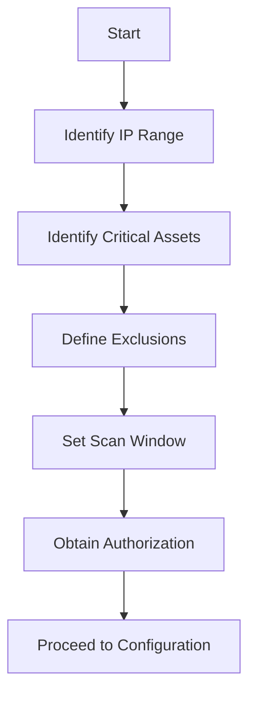
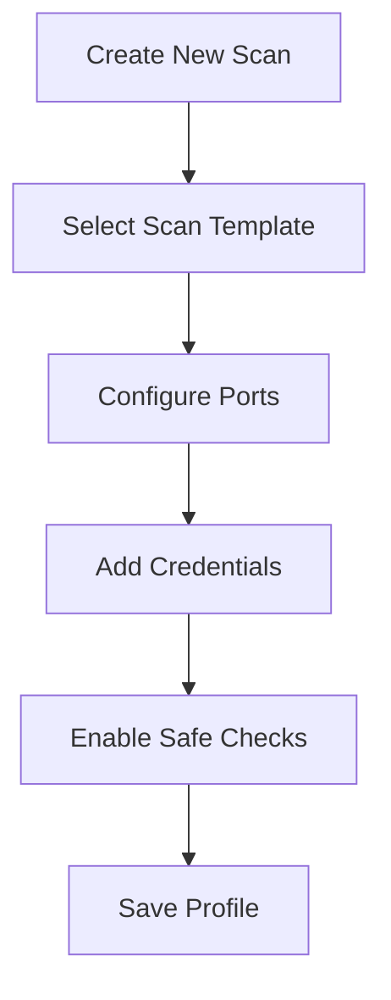
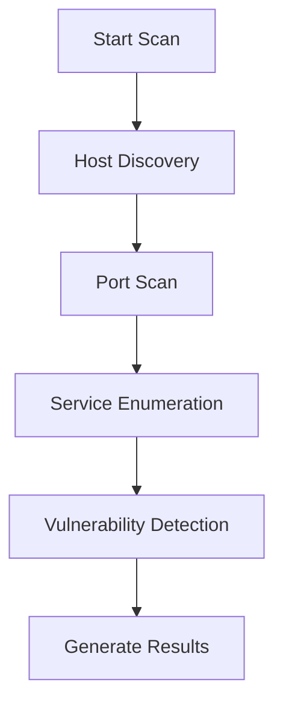
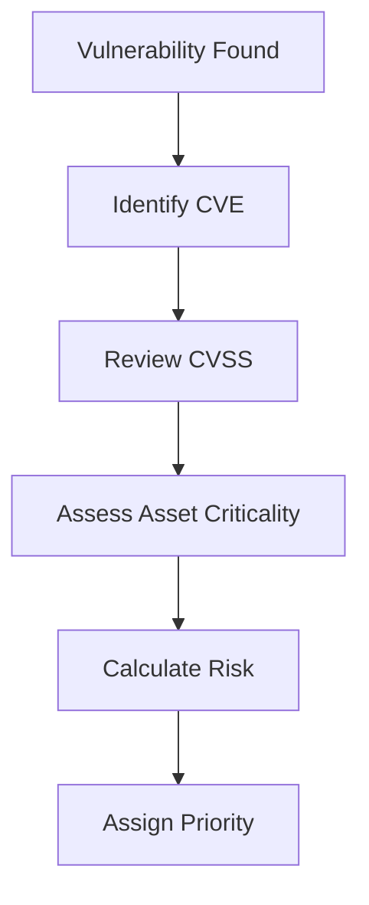
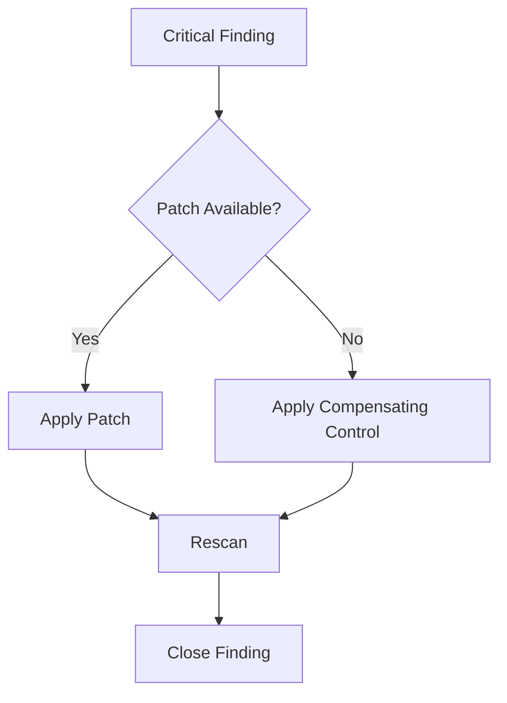
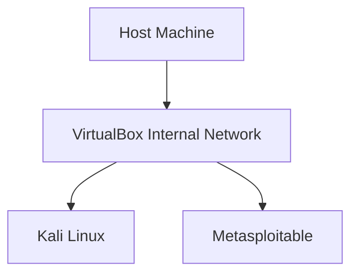

Here is your **fully unified, clean, GitHub-ready master README** — combining:

* Structured lab manual
* Practical walkthrough tone
* Mermaid flowcharts
* Screenshot sections (using image groups)
* Professional documentation style
* Metasploitable-style vulnerable lab setup
* Clear enterprise-ready formatting

You can paste this directly into `README.md`.

---

# 🛡️ Vulnerability Assessment Lab Manual

### Structured + Practical Walkthrough

This repository documents a complete **Vulnerability Assessment (VA)** workflow performed in a controlled lab environment.

The goal was not just to “run a scanner,” but to:

* Understand what the scanner is actually doing
* Interpret vulnerabilities in business context
* Map findings to CVE and CVSS
* Prioritize remediation based on risk
* Produce a professional assessment report

---

# 📌 Overview

This lab covers:

* Scope definition & authorization
* Pre-scan validation
* Scanner configuration
* Vulnerability discovery
* CVE & CVSS mapping
* Risk classification
* Remediation planning
* Vulnerable lab setup (Metasploitable-style)

---

# 🎯 Lab Objectives

By completing this lab, you will be able to:

* Define assessment boundaries
* Configure enterprise-grade scanners
* Perform authenticated and unauthenticated scans
* Interpret vulnerability output
* Map findings to CVE and CVSS
* Prioritize remediation based on business risk
* Produce a professional vulnerability report

---

# 🧰 Tools Used

* Nessus
* OpenVAS
* Qualys
* Nmap (pre-scan validation)

---

# 🏗️ Lab Environment

| Component        | Description             |
| ---------------- | ----------------------- |
| Target OS        | Windows Server / Ubuntu |
| Attacker Machine | Kali Linux              |
| Scan Type        | Internal Network Scan   |
| Scope Example    | 192.168.1.0/24          |

---

# 🔹 Phase 1 – Define Scope

Before touching any scanner, define:

* Target IP range: `192.168.1.0/24`
* Critical assets:

  * Domain Controller
  * Web Server
  * Database Server
* Scan window: 10 PM – 2 AM
* Scan type: Internal authenticated scan

This prevents:

* Legal violations
* Service disruption
* IDS/IPS escalations

---

### 📊 Scope Definition Flow



---

# 🔹 Phase 2 – Pre-Scan Validation (Nmap)

Before launching the vulnerability scanner:

```bash
nmap -sS -sV 192.168.1.10
```

Purpose:

* Validate live hosts
* Identify open ports
* Detect running services
* Confirm expected exposure

---

## 📸 Example: Nmap Output


What to observe:

* Is SMB (445) open?
* Outdated Apache?
* Unnecessary services exposed?

---

# 🔹 Phase 3 – Scanner Configuration

Using **Nessus** as example.

## Configuration Checklist

| Setting     | Recommended           |
| ----------- | --------------------- |
| Scan Type   | Advanced Network Scan |
| Port Range  | 1–65535               |
| Credentials | Enabled               |
| Safe Checks | Enabled               |
| Max Hosts   | Limited               |

---

## Credentialed vs Unauthenticated

| Type            | Visibility                    |
| --------------- | ----------------------------- |
| Unauthenticated | Surface-level detection       |
| Credentialed    | Patch level + local misconfig |

Credentialed scans detect:

* Missing patches
* Weak registry settings
* Local privilege escalation
* Configuration drift

---

## 📸 Example: Scanner Configuration


---

### 📊 Scanner Configuration Flow



---

# 🔹 Phase 4 – Execute Scan

Scanner workflow:

1. Host Discovery
2. Port Scanning
3. Service Enumeration
4. Vulnerability Matching
5. Severity Assignment

---

## 📸 Example: Scan Dashboard


Monitor:

* CPU utilization
* Network spikes
* Service responsiveness

---

### 📊 Scan Execution Flow



---

# 🔹 Phase 5 – Review Findings

Severity Levels:

| Severity | CVSS      |
| -------- | --------- |
| Critical | 9.0 – 10  |
| High     | 7.0 – 8.9 |
| Medium   | 4.0 – 6.9 |
| Low      | 0.1 – 3.9 |

Example findings:

```
Critical: Remote Code Execution
High: SMBv1 Enabled
Medium: TLS 1.0 Enabled
Low: Missing Security Headers
```

---

## 📸 Example: Vulnerability Detail Page


CVE database maintained by:

* MITRE Corporation

---

# 🔹 Phase 6 – Risk Classification

Risk ≠ Severity.

Risk formula:

```
Risk = Likelihood × Impact
```

Example:

| Vulnerability | CVSS | Asset             | Final Risk |
| ------------- | ---- | ----------------- | ---------- |
| SMBv1         | 8.8  | Domain Controller | Critical   |
| Weak Cipher   | 5.3  | Dev Server        | Low        |

---

### 📊 Risk Evaluation Flow



---

# 🔹 Phase 7 – Remediation Strategy

## Patch Management

* Apply vendor updates
* Upgrade vulnerable components

## Configuration Hardening

* Disable SMBv1
* Disable TLS 1.0
* Remove unused services

## Access Controls

* Enforce MFA
* Remove excessive admin privileges

## Compensating Controls

* Firewall restrictions
* Network segmentation
* IDS/IPS monitoring

---

### 📊 Remediation Workflow



---

# 🧪 Vulnerable Lab Setup (Metasploitable-Style)

To practice safely, create an isolated vulnerable environment.

⚠️ Never expose vulnerable machines to the internet.

---

## 🧰 Required Components

* VirtualBox
* Kali Linux
* Metasploitable 2
* Damn Vulnerable Web Application

---

## 🏗️ Network Architecture

```
        [ Kali Linux ]
              |
      ------------------
      | Internal Net   |
      ------------------
              |
       [ Metasploitable ]
```

Use:

* Internal Network only
* No NAT
* No Bridged adapter

---

### 📊 Lab Architecture Flow



---

## 🔹 Deploy Metasploitable

Default credentials:

```
Username: msfadmin
Password: msfadmin
```

Verify IP:

```bash
ifconfig
```

From Kali:

```bash
ping <target-ip>
```

---

## 🔍 Scan the Vulnerable Machine

```bash
nmap -sS -sV <target-ip>
```

Expected exposed services:

* FTP
* Telnet
* SMB
* Apache
* MySQL
* Tomcat

---

## 📸 Example: Metasploitable Scan


Then run:

* Nessus
* OpenVAS

Observe large number of CVEs and outdated services.

---

# 📄 Final Report Structure

1. Executive Summary
2. Scope
3. Methodology
4. Tools Used
5. Risk Rating Model
6. Detailed Findings
7. Remediation Plan
8. CVE Appendix

---

# 🔬 Vulnerability Assessment vs Penetration Testing

| Vulnerability Assessment | Penetration Testing     |
| ------------------------ | ----------------------- |
| Identifies weaknesses    | Exploits weaknesses     |
| Mostly automated         | Manual + automated      |
| Risk prioritization      | Proof-of-concept attack |
| Defensive focus          | Offensive validation    |

---

# 🚀 Lab Completion Criteria

* Scan successfully executed
* CVE mapped
* CVSS interpreted
* Risk classified
* Remediation documented
* Final report generated

---

# 🧠 Key Takeaway

Vulnerability assessment is not about pressing “Scan.”

It is about:

* Understanding exposure
* Evaluating business impact
* Prioritizing intelligently
* Communicating clearly

---

If you want next:

* 🔥 Add exploitation walkthrough (safe + structured)
* 🛡 Convert into Red vs Blue lab
* 📘 Add CEH-style challenges
* 🧠 Add SOC monitoring layer
