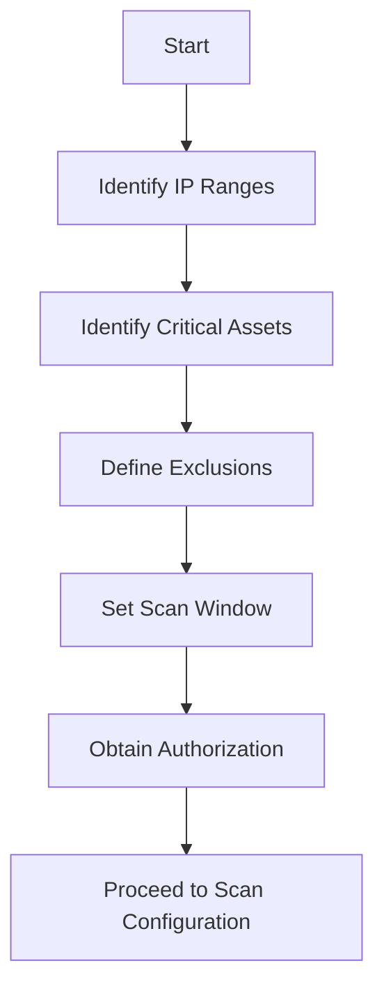
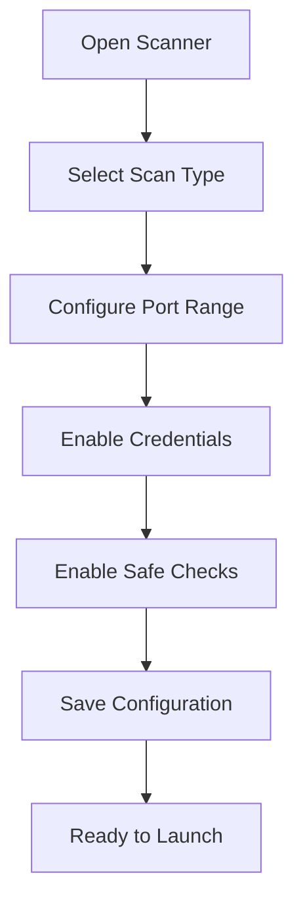
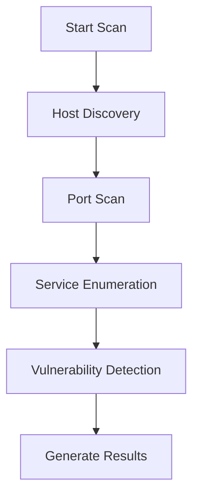
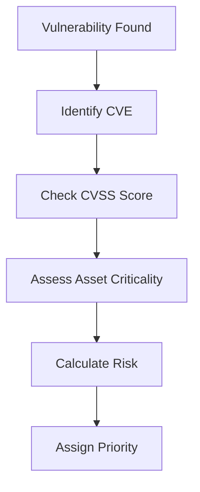
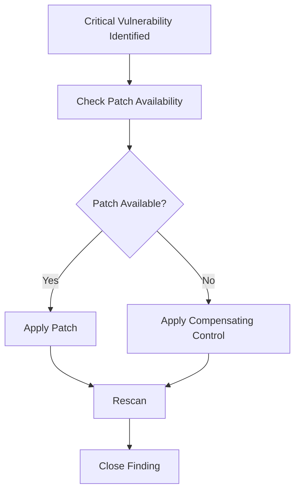

Below is a **GitHub-ready Lab Manual** in clean Markdown format.
It includes structured sections, command references, methodology, and flowcharts (in Mermaid format for GitHub rendering).

You can copy this directly into `README.md`.

---

# 🛡️ Vulnerability Assessment Lab Manual

## 📌 Overview

This lab demonstrates how to conduct a structured **Vulnerability Assessment (VA)** using industry-standard methodology and tools.

The objective is to:

* Identify security weaknesses
* Classify vulnerabilities by risk
* Map findings to CVE & CVSS
* Recommend remediation strategies
* Produce a professional assessment report

---

# 🎯 Lab Objectives

By completing this lab, you will be able to:

* Define scope and authorization boundaries
* Configure a vulnerability scanner
* Perform authenticated and unauthenticated scans
* Interpret scan results
* Map vulnerabilities to CVE and CVSS scores
* Prioritize remediation
* Generate a structured vulnerability report

---

# 🧰 Tools Used

* Nessus
* OpenVAS
* Qualys
* Nmap (for pre-scan validation)

---

# 🏗️ Lab Environment

| Component        | Description             |
| ---------------- | ----------------------- |
| Target OS        | Windows Server / Ubuntu |
| Attacker Machine | Kali Linux              |
| Scan Type        | Internal Network Scan   |
| Scope Example    | 192.168.1.0/24          |

---

# 🔹 Phase 1: Define Scope

## Objective

Ensure legal authorization and prevent operational disruption.

### Steps:

1. Identify IP range:

   ```
   192.168.1.0/24
   ```
2. Identify critical assets:

   * Domain Controllers
   * Web Servers
   * Database Servers
3. Exclude sensitive systems if required.
4. Define scan window (e.g., 10 PM – 2 AM).

### Deliverable:

Signed Scope Document.

---

### 📊 Flowchart – Scope Definition



---

# 🔹 Phase 2: Scanner Configuration

## Objective

Optimize scan depth while preventing disruption.

### Configuration Checklist

| Setting     | Recommended Value           |
| ----------- | --------------------------- |
| Scan Type   | Advanced Network Scan       |
| Port Range  | 1–65535                     |
| Credentials | Enabled (if authorized)     |
| Safe Checks | Enabled                     |
| Max Hosts   | Controlled (avoid overload) |

### Credentialed vs Unauthenticated

| Type            | Visibility                                     |
| --------------- | ---------------------------------------------- |
| Unauthenticated | Surface-level detection                        |
| Credentialed    | Patch level, local misconfigs, registry issues |

---

### 📊 Flowchart – Scanner Configuration



---

# 🔹 Phase 3: Execute Vulnerability Scan

## Pre-Scan Validation

```bash
nmap -sS -sV 192.168.1.10
```

Purpose:

* Validate host availability
* Identify exposed services
* Confirm scan scope

---

## Launch Scan

Steps:

1. Select configured profile
2. Start scan
3. Monitor:

   * CPU usage
   * Network spikes
   * Packet loss

---

### Scan Lifecycle

1. Host Discovery
2. Port Scanning
3. Service Enumeration
4. Vulnerability Matching
5. Report Generation

---

### 📊 Flowchart – Scan Execution



---

# 🔹 Phase 4: Review Findings

Results categorized by severity:

| Severity | CVSS Range |
| -------- | ---------- |
| Critical | 9.0 – 10   |
| High     | 7.0 – 8.9  |
| Medium   | 4.0 – 6.9  |
| Low      | 0.1 – 3.9  |

---

Example Output:

```
Critical: Apache Path Traversal
High: SMBv1 Enabled
Medium: TLS 1.0 Enabled
Low: Missing HTTP Security Headers
```

---

# 🔹 Phase 5: CVE & CVSS Mapping

CVE database maintained by:

* MITRE Corporation

Each vulnerability includes:

```
CVE-YYYY-XXXX
```

Example:

```
CVE-2021-44228
```

---

## CVSS Metrics

CVSS evaluates:

* Attack Vector (AV)
* Attack Complexity (AC)
* Privileges Required (PR)
* User Interaction (UI)
* Confidentiality Impact (C)
* Integrity Impact (I)
* Availability Impact (A)

---

### 📊 Flowchart – Risk Calculation



---

# 🔹 Phase 6: Risk Classification

Formula:

```
Risk = Likelihood × Impact
```

Factors:

* Internet exposure
* Exploit availability
* Asset value
* Business impact

Example:

| Vulnerability | CVSS | Asset             | Risk     |
| ------------- | ---- | ----------------- | -------- |
| SMBv1         | 8.8  | Domain Controller | Critical |
| Weak Cipher   | 5.3  | Dev Server        | Low      |

---

# 🔹 Phase 7: Prioritization

Highest priority:

* Remote Code Execution
* Authentication Bypass
* Privilege Escalation
* Default Credentials

---

# 🔹 Phase 8: Remediation

## Patch Management

* Apply vendor security updates
* Upgrade vulnerable services

## Configuration Hardening

* Disable TLS 1.0
* Disable SMBv1
* Remove unused services

## Access Control

* Enforce MFA
* Remove excessive admin rights

## Compensating Controls

* Firewall restrictions
* Network segmentation
* WAF implementation

---

### 📊 Flowchart – Remediation Workflow



---

# 📄 Final Report Structure

1. Executive Summary
2. Scope
3. Methodology
4. Tools Used
5. Risk Rating Model
6. Detailed Findings
7. Remediation Plan
8. Appendix (CVE References)

---

# 🔬 Key Distinction

| Vulnerability Assessment  | Penetration Testing           |
| ------------------------- | ----------------------------- |
| Identifies weaknesses     | Exploits weaknesses           |
| Automated                 | Manual + Automated            |
| Risk-based prioritization | Proof-of-concept exploitation |

---

# 🚀 Lab Completion Criteria

* Scan successfully executed
* CVE mapped
* CVSS interpreted
* Risk classified
* Remediation documented
* Final report generated

---

# 🧠 Learning Outcome

After completing this lab, you should:

* Understand enterprise vulnerability workflows
* Interpret real-world scanner outputs
* Think in terms of risk instead of just severity
* Produce professional-grade assessment documentation

---

If you want, I can now:

* Add screenshots and visual diagrams
* Convert this into a PDF-ready formatted report
* Add a mini vulnerable lab setup guide
* Add CEH-style quiz questions based on this lab
